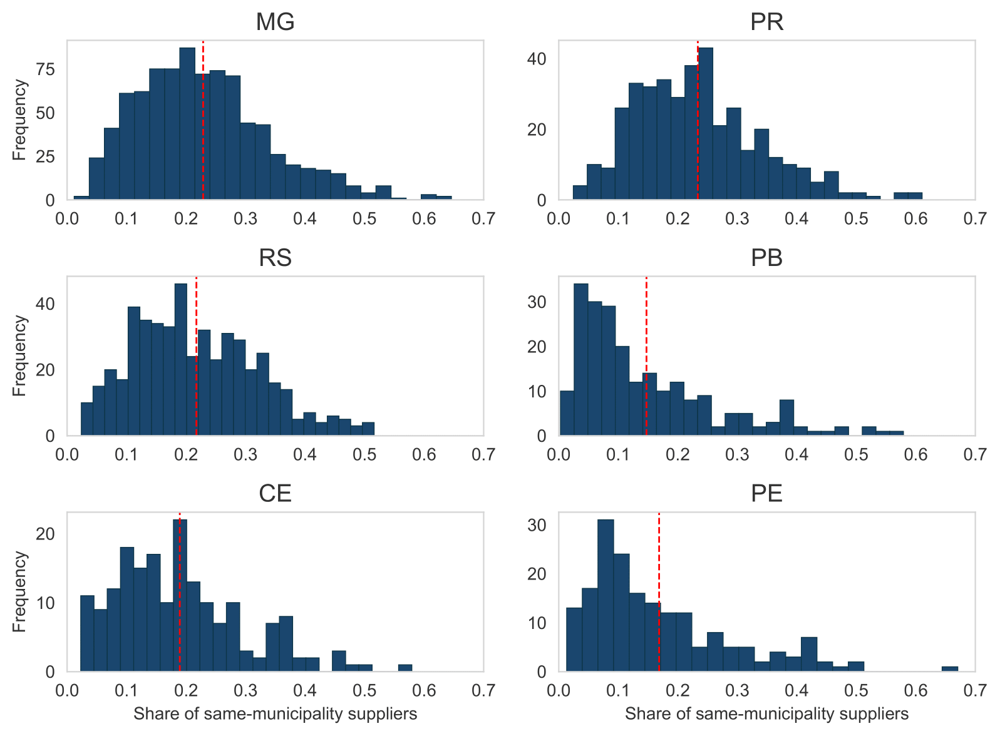
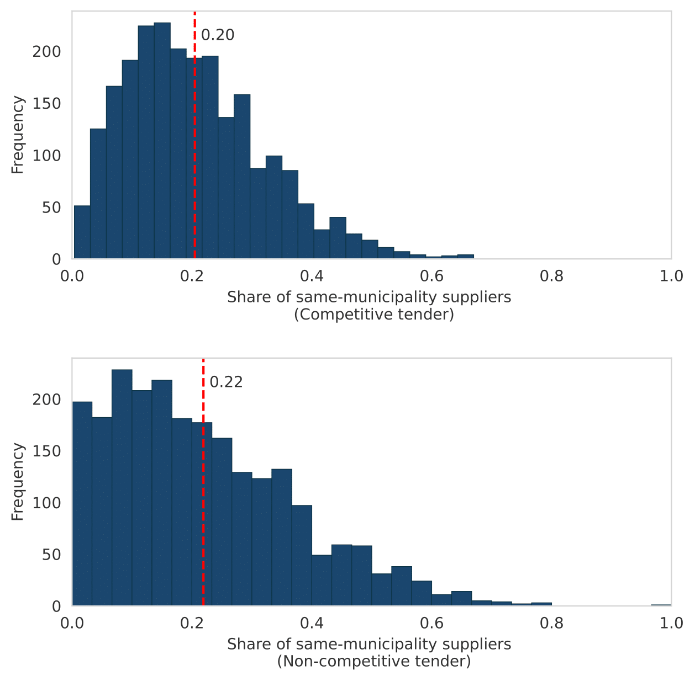
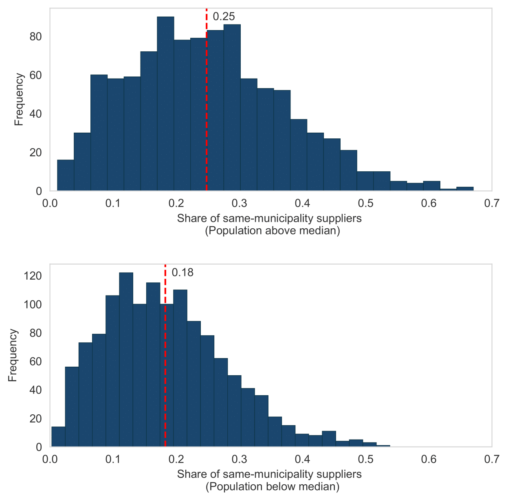
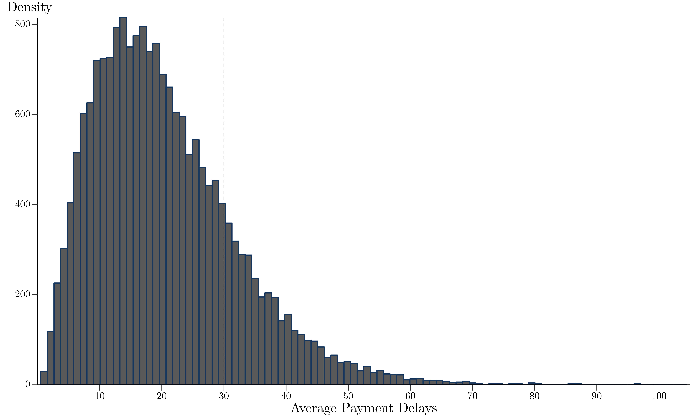
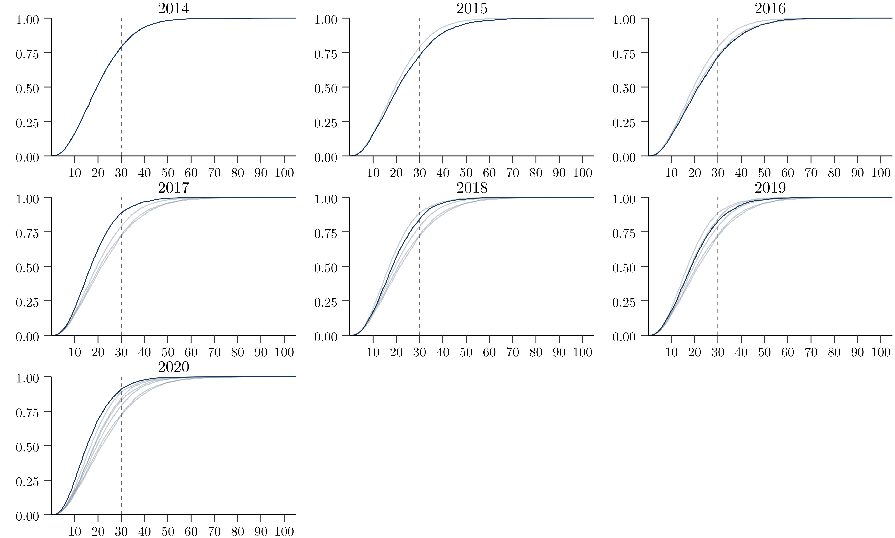

# Aplication

## Local firm contracting in public procurement
Using our newly created dataset on local public procurement in Brazil, we investigate how much geographical variation exists in the location of government suppliers. According to
García-Santana and Santamaría (2023), government purchases are highly locally concentrated worldwide. This phenomenon may occur due to supply factors such as regional economic specialization and lack of a diverse local production sector, or frictions such as transportation costs, geography or information asymmetries. It may also be explained by demand factors such as buy-local policies. These policies are ubiquitous across countries, but there is limited evidence regarding whether governments unofficially favor local suppliers even if a formal buy-local policy does not exist.García-Santana and Santamaría (2023) provide compelling evidence that regional governments in Spain and France present home bias, i.e. they favor local suppliers.  

In this section, we document the prevalence of local suppliers across Brazilian municipalities, measuring the share of purchases from local governments flowing to firms located in the same municipalities. No such information exists currently in Brazil due to the lack of consistent data on the identity of municipal government suppliers - an information gap we fill with our dataset. We merge the identity of around 575,000 suppliers in local contracts with information on which municipality they are registered in - given by the _Cadastro Nacional de Pessoas Jurídicas_ (CNPJ), a dataset provided by the Ministry of Economy. We consider a firm local if it operates within the municipality, regardless of whether it is a headquarters or a branch.

In Figure 1, we present the distribution of the share of local purchases provided by suppliers located in the same municipality in each state, pooling all purchases from 2014 to 2021. PR and MG are the states in which local contracting is higher on average - the mean municipality observation purchases almost one-quarter of its goods and services from suppliers located in the same municipality. RS and CE have slightly lower averages but similar distributions. In contrast, PE and PB exhibit considerably lower levels of local firms contracting, with the entire distribution shifted to the left. However, it is worth noting that, within states, we still observe a large variation in the levels of local contracting. Take MG, for example, a state with more than 800 municipalities. According to our data, the municipalities of _Baldim_ and _Ibirité_ procured less than 10% of total purchases from firms located in the same municipality, whereas municipalities like _Almenara_ and _Taiobeiras_ procured over 60% from local suppliers.

<em> Figure 1: Distribution of share of local suppliers across different states</em>

An important source of heterogeneity discussed in the public procurement literature, which might also affect the identity of suppliers, is the modality of purchase. In general, purchases can be divided into competitive and non-competitive tenders, as described in [procurement](procurement_methods.md#procurement-methods). The literature showing the effects of discretion on procurement outcomes documents that it may have potential negative impacts on efficiency and corruption (Baltrunaite et al., 2021; Decarolis et al., 2020; Palguta and Pertold, 2017). One explanation is related to favoritism, once lack of competition may favor government bureaucracy to engage in opportunistic behavior for private benefit by awarding contracts to local and/or connected firms. These supplier firms may not be the most efficient, leading to overpricing and other inefficiencies. Using Brazilian federal procurement data, (Fazio, 2022) finds evidence that although public agencies use discretion to purchase higher-quality products, they also use it to favor firms that are politically connected, located in the same municipality as the government agency, larger, and older[^1].

In order to investigate this heterogeneity, in Figure 2 we present the distribution of the share of same-municipality suppliers by competitive and non-competitive tenders separately. Non-competitive tenders are those classified as a tender waiver (_dispensa_) or non-requirement tender (_inexigibilidade_)[^2]. Under the assumption that buying from local suppliers reveals political favoritism and that this is more likely to be enacted in discretionary, non-competitive tenders, we would expect a much larger share of local suppliers in the latter modality. This is not what we document: the average share of purchases from local suppliers is very similar at approximately 20% for both modalities. We do observe more dispersion in non-competitive tenders: while the distribution for competitive ones shows concentration around the mean, in non-competitive tenders we observe both a larger share of municipalities for which almost no suppliers are local and also a larger share with large participation of local suppliers[^3].

<em> Figure 2: Distribution of share of local suppliers, by type of purchase</em>

To analyze the supply-side factor, we present the share of same-municipality suppliers for municipalities below and above the median population, as illustrated in Figure 3. Notably, the calculated median for our dataset, using the 2018 population, stands at 11,590. Within smaller municipalities, the range of economic activities tends to be narrower and less diverse. This likely translates to a scarcity of local businesses available to adequately address the requirements of the local government. In addition, even if there is a supplier for some purchase, smaller municipalities might lack local competition, which can result in higher prices being charged by local suppliers in comparison to suppliers located in more competitive markets. So it is possible that policy-makers in those small municipalities might actually encourage the participation of firms from other areas.

<em> Figure 3: Distribution of share of local suppliers, by population size</em>

We document a pattern of local purchases consistent with those conjectures: on average, municipalities with above-median population present a 7 p.p. higher share of local suppliers (25% vs. 18% for those below median), and the entire distribution of local purchases is shifted to the left for smaller municipalities. 

## Timeliness in government payments
Another important dimension of procurement practices is the timeliness of payments.  Stretched payment terms increase the length of time between the payments for inputs and the receipt of cash from customers, increasing the working capital needs and financial expenses of suppliers. Previous research has documented the importance of trade credit terms for the performance of firms (Checherita-Westphal et al., 2016; Breza and Liberman, 2017). In extreme cases, late payments can lead to default and bankruptcy.

Governments across the world often take long to pay their suppliers: procuring entities take on average 100 days to pay firms, with vast variation across countries (Bosio et al., 2022). This has several important implications. First, government purchases are a large share of the economy and a substantial revenue source for firms, affecting their future growth and employment trajectory (Ferraz et al., 2015). When governments take long to pay their suppliers, they impose an additional financial cost on firms deciding to supply, and potentially exclude small and medium-sized firms that are more likely to be liquidity constrained (Barrot and
Nanda, 2020). Second, if firms understand these additional financial costs, firms may avoid competing for government contracts or, upon deciding to compete, only accept higher prices that make up for the additional liquidity necessary to finance themselves. In either case, that may reduce the cost-effectiveness of public purchases and/or lead to worsening of the quality of goods and services procured. Some government have explicitly introduced reforms to accelerate payment to suppliers: Barrot and
Nanda (2020) discuss the impact of _QuickPay_, which decreased the payment delay from 30 to 15 days for small business in the U.S. in 2011; and Chile introduced the Centralized Payment Platform (PPC, Spanish acronym for _Plataforma de Pagos Centralizados_) in 2020, which centralized payments from purchasing units to the Treasury and started to enforce a 30-day limit to payments.

We document payment timeliness across Brazilian municipalities using a sample from the dataset. We highlight this exercise is only possible by using microdata on the entire budget executing process. In an ideal scenario, we would be able to connect each payment
to a single verification, and then compute average payment delays at the verification level.
In practice, the majority of payments are connected to one commitment, but not to a verifi-
cation. We instead compute payment delays at the commitment level – in cases where one
commitment is linked to more than one verification and more than one payment, we compute
amount-weighted-dates for verifications and payments, and then determine payment delay
as the difference between these two dates[^4]. We restrict our sample to procurement-related
commitment, to focus on delay to suppliers, and further restrict it to the purchase of goods
and materials – since verifications of services are often more complex and numerous.

Procurement law in Brazil determines that payments should be made no later than 30 days after the verification, with a shorter limit of 5 days for bid waiver processes *dispensa de licitação*. In Figure 4 below, we present the distribution of the average payment delay at the municipality-by-year level, where average delays are calculated using the total amount of committed funds as weights (so it can be interpreted as the average delay to pay 1 BRL). In Figure 4a, we show the histogram of our delay measure -- the distribution is centered around 15 days, showing that in the majority of municipality-year observations the average payment delay is well below the 30 day limit. 

<em> Figure 4a: Distribution of payment delays at municipality-year level - Histogram</em>

We also document, nonetheless, a large right tail of observations with average delays well above 30 days: in Figure 4b, we show that approximately 20% of municipality-years have an average payment delay above 30 days, and many are above 45 or even 60 days. Overall, approximately 15% of the total amount paid in the procurement of goods and materials in recent years is made in more than 30 days.

<em> Figure 4b: Distribution of payment delays at municipality-year level - Cumulative Distribution Function (CDF)</em>

Panel 4a presents the histogram of average payment delay at the municipality-year level, where
average delay is weighted by total committed amount. The dotted line marks the 30-day threshold, the
maximum allowed payment delay for procurement in Brazil. The underlying data cover the 2014-2018 period and six states (CE, MG, PB, PR, RS and SP). PE was not included due to our
inability to match payments to their respective commitments at the time.

<Footnotes>
[^1]: In the Hungarian context, Szucs (2023) finds a similar result - winners of high discretion procedures are more likely to be domestically owned. On the other hand, contracts in high discretion procedures tend to be awarded to younger and smaller firms.

[^2]: The first one consists of cases in which competition would be feasible, but the government chooses not to carry out the tender process - which is possible under a specific threshold established by procurement law. On the other hand, non-requirement occurs when competition is impossible (i.e. only one possible supplier, acquisition of unique goods or hiring of specialized professionals).

[^3]: It is worth mentioning that we can only calculate this measure for suppliers whose national identifier consists of 14 digits - firms with a CNPJ. In our dataset we also have individual suppliers, registered with an 11-digit identifier (CPF). For those cases, we can not identify whether the purchases are more or less local, but we do know that non-competitive tenders represents a larger share of total number of purchases for individual suppliers (63%) than for firms (24%). If individual suppliers - which tend to be smaller - are more local, we might expect the distribution in the second panel to be shifted to the right.

[^4]: Details on the methodology to compute delays in complex situations, when one commitment is linked to several verifications and several payments, are discussed in Ricca (2019).