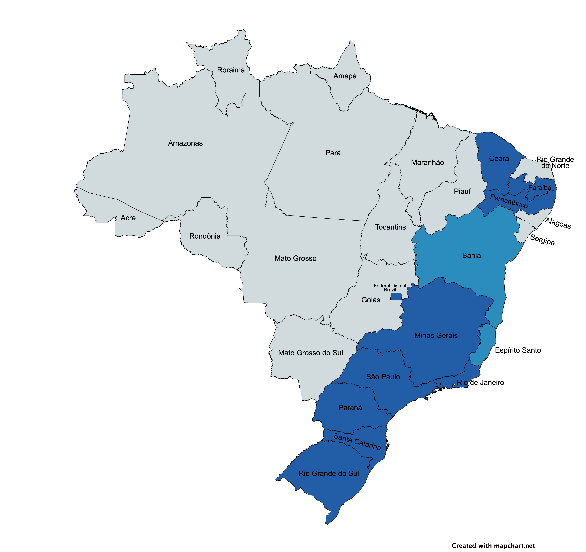

# **MiDES: New Data and Facts from Local Procurement and Budget Execution in Brazil** 

## Overview

We introduce a new dataset on municipal public finance in Brazil called MiDES (_Microdados de Despesas de Entes Subnacionais_[^1]) that allows users to answer several fiscal questions. We collect, clean, and harmonize microdata on public procurement and budget execution that covers more than half of the total municipalities of Brazil and represents over 40\% of the country's population.  

The repository shows the full process of creation and understanding about our data. We collect from several Brazilian states data provided by State Audit Courts (_TCEs_ in Portuguese) about budget execution and procurements. Initially, we show this enforcement in [working paper](https://documents.worldbank.org/en/publication/documents-reports/documentdetail/099456511072320917/idu0577a4ea10ff8504db6089400548fa91b30a3) published by the World Bank with seven states. Here, we publish updates about our dataset with more States. We provide the original source, processing codes, queries, and other analyses.

Our dataset on municipal budget execution currently cover ten of Brazil's twenty-seven states, highlighted in Figure 1: Ceará (CE), Distrito Federal (DF), Minas Gerais (MG), Paraíba (PB), Pernambuco (PE), Paraná (PR), Rio de Janeiro (RJ), Rio Grande do Sul (RS), Santa Catarina (SC)and São Paulo (SP). These are large states that cover a substantial share of the total number of municipalities (60%), population (67%), and GDP (76%) of the country according to 2021 data. Notably, our dataset only covers states in the South, Southeast and Northeast regions - data from the states in the North and Center-West regions are currently not available[^2]. Our procurement dataset allows users to see information on specific tenders, such as the number, reserve price, and description of items being sold, the number of participants in competitive tenders, and the identity of participants and winning parties covering six states: CE, MG, PB, PE, PR and RS. On the budget execution side, the data includes information on each commitment, verification (an important step in the budget spending when buyers recognize that a good or service was delivered), and payments, again allowing users to see the identity of payees and the amount and dates of each step of the budget execution. In particular, we can compute the time to pay a particular transaction by using the time elapsed between the verification and payment stages.

<!-- Query Proportion
WITH sample AS (
  SELECT
    sigla_uf,
    id_municipio,
    1 AS amostra,
  FROM `basedosdados.br_bd_diretorios_brasil.municipio`
  WHERE sigla_uf in ('DF', 'CE', 'MG', 'PB', 'PE', 'PR', 'RS', 'SP', 'RJ', 'SC')
)

SELECT 
  SUM(1) AS N,
  SUM(1 * sample.amostra) AS N_munic,
  100 * SUM(1 * sample.amostra) / SUM(1) AS prop_munic,
  100 * SUM(pop.populacao * sample.amostra) / SUM(pop.populacao) AS prop_populacao,
  100 * SUM(gdp.pib * sample.amostra) / SUM(gdp.pib) AS prop_pib
FROM `basedosdados.br_bd_diretorios_brasil.municipio` AS dir
LEFT JOIN sample
  ON dir.id_municipio = sample.id_municipio
LEFT JOIN `basedosdados.br_ibge_populacao.municipio` AS pop
  ON dir.id_municipio = pop.id_municipio
LEFT JOIN `basedosdados.br_ibge_pib.municipio` AS gdp
  ON dir.id_municipio = gdp.id_municipio
WHERE pop.ano = 2021 AND gdp.ano = 2021
 -->



## Temporal coverage

We provide further details on the geographical and temporal coverage of the dataset in Table 1. Starting with geographical coverage, our budget execution tables (commitment, verification, and payment) are available for all ten states. The procurement data are less comprehensive: the dataset currently includes no procurement data for SP, and the data for PB and PE include information on tenders and participants, but not on the more disaggregated level of items. We are working currently in SC raw data. In terms of temporal coverage, most of our budget execution data starts in the early- to mid-2000s, with the exception of PE (2012), PR (2013), and MG (2014), and currently runs until 2021. Once again, data on procurement is less comprehensive and, with the exception of CE (2009-2021), starts in the mid-2010s.


| State | # municipalities | Commitment | Verification | Payments | Temporal Coverage Budget Execution | Tender | Tender Item | Tender Participants | Temporal Coverage Procurement |
|-------|------------------|------------|--------------|----------|------------------------------------|--------|-------------|---------------------|-------------------------------|
| CE    | 184              | ✓          | ✓            | ✓        | 2009-2021                          | ✓      | ✓           | ✓                   | 2009-2021                     |
| DF    | 1                | ✓          | ✓            | ✓        | 2009-2023                          |        |             |                     |                               |
| MG    | 853              | ✓          | ✓            | ✓        | 2014-2021                          | ✓      | ✓           | ✓                   | 2014-2021                     |
| PB    | 223              | ✓          | ✓            | ✓        | 2014-2021                          | ✓      |             | ✓                   | 2014-2021                     |
| PE    | 185              | ✓          | ✓            | ✓        | 2012-2021                          | ✓      |             | ✓                   | 2012-2021                     |
| PR    | 399              | ✓          | ✓            | ✓        | 2013-2021                          | ✓      | ✓           | ✓                   | 2013-2021                     |
| RJ    | 92               | ✓          | ✓            | ✓        | 2002-2022                          |        |             |                     |                               |
| RS    | 497              | ✓          | ✓            | ✓        | 2016-2021                          | ✓      | ✓           | ✓                   | 2016-2021                     |
| SC    | 276              | ✓          | ✓            | ✓        | 2021-2024                          |        |             |                     |                               |
| SP    | 645              | ✓          | ✓            | ✓        | 2008-2021                          |        |             |                     |                               |


## Institutional context
The last decades have seen a remarkable expansion in the number of subnational units across the world and their roles in providing public services (Gadenne and Singhal, 2014; Grossman and Lewis, 2014; Dahis and Szerman, 2023). As their role in service provision increased, so did their economic relevance - in Brazil, municipal procurement was equivalent to approximately 3% of GDP between 2002 and 2019, or about 25%-30% of total purchases by all levels of government - federal, state, and municipal (Thorstensen and Giesteira, 2021). 

Data on local governments are often only available at an aggregate level, e.g. the total amount of purchases of goods and services, the total amount spent on health services, and the total amount of accrued liabilities. Consequently, many simple yet important questions related to the public finances of these units remain unanswered. Which are the suppliers of local governments, and what are their characteristics (e.g., size, location)? What is the share of purchases that happen through competitive tenders versus non-competitive methods? When competitive auctions take place, what is the degree of competition?

Another crucial dimension of local governments' finances is how they execute their budgets. While aggregate commitment and spending amounts are easier to come by, we know little about the details of the budget execution. For instance, how long does it take to pay suppliers after deliveries are recognized? Is there a large variability in the payment timeliness across purchases within the same government? Do governments treat suppliers equally regarding payment timeliness? Answers to these questions can shed new light on the effectiveness of local governments and on their interaction with other economic agents. Similarly, when facing liquidity constraints, do governments prioritize the payment of some government functions at the expense of others? Payment delays impose several costs on suppliers and might affect the provision of public goods (Flynn and Pessoa, 2014). The importance of this issue is reflected in several recent regulations and initiatives that governments implemented in an attempt to shorten payment terms[^2]. Yet, the scarcity of granular data on the stages of the budget execution renders the answers to these questions elusive[^3].

## Acessing database

The database is hosted in [BasedosDados](https://basedosdados.org/dataset/d3874769-bcbd-4ece-a38a-157ba1021514?table=14c5d05b-9830-4710-b7ac-7e0ca1bf9d8b). For access database in BigQuery, you can follow this [steps](https://basedosdados.github.io/mais/access_data_bq/) to create a personal project and create your queries. The most simple query is

```sql
SELECT * FROM `basedosdados.world_wb_mides.empenho` LIMIT 100
```
The output is a hundred observations about commitments.

<Footnotes>

[^1]: The English translation of _Microdados de Despesas de Entes Subnacionais_ is Subnational Entities' Expenditure Microdata.

[^1]: Municipalities that are in our sample are slightly richer and more educated than those that are not. In 2019, the average GDP per capita (literacy rate) in our sample was 26.8 thousand BRL (87.7\%), while in the municipalities that are not in our sample it was 22 thousand BRL (82.5\%). Population size, however, does not differ across the samples (37.7 thousand inhabitants in both)

[^2]: Examples include the QuickPay initiative, launched in 2011 in the United States; Regulation 113 of the Public Contracts Regulations, passed in 2015 in the United Kingdom; and the introduction of the Centralized Payment Platform (PPC) in 2020 in Chile.

[^3]: According to Potter et al. (1999): "For the fiscal economist seeking to monitor budget execution, choosing which stage(s) of the expenditure management procedure to monitor is often constrained by information availability. In principle, the data given at the verification stage may be particularly relevant because they measure the actual liability of the public entity and thus the accrued account liability. For example, if bills are verified promptly when they arrive, it allows a good measure of the potential arrears, where strict cash limits constrain the amounts available to make payments. But such information is rarely available."