# Original Sources

This documentation contains information about the main files and sources used in the construction of public procurement and budget execution tables. All details about treatment and data configuration is available [here](https://github.com/municipal-budget-execution/mides/tree/main/code/treatment). Additionally, we list open questions and limitations encountered throughout the project by state.

## CE - Ceará

Available at https://api.tce.ce.gov.br/ since 2009. The State Court offers an API to get the data. 

The **bid** from files (*licitacoes*) bring together general information about competitive bids and exemptions/non-enforceability. For the **bid-iten** table we merge *itens_licitacoes* and *licitantes* files. The first contains information about the bid items and the second about the winners. For the **bid-participant** we remove duplicates at the id, municipality and year level, e.g., participants who win more than one item in the same bid. The construction of `id_licitacao_bd` not generate unique id (around 0.87% are duplicated) analyzing the relevant variables as municipality, entity, year. For example, we have a bid with same number, description and values (described better [here](https://municipios-transparencia.tce.ce.gov.br/index.php/municipios/licitacoes/mun/031/versao/2019)), but directioned to different entities:  
FMS04.03.002/19  
PMB04.03.002/19  
FMA04.03.002/19  
FME04.03.002/19
These cases give reasons to believe that we have the same bid, altought we exclude here the observations duplicated. 

In **commitment** table we use *notas_empenhos* and *anulacoes_empenho*, while **verification** is based in *liquidacoes* and *estornos_liquidacoes*, as **payment** table is from *notas_pagamentos* and *estornos_pagamentos*. All this observations is identified by a commitment number not unique. We create *id_empenho_bd* concatenating some variables as municipality, year and entity ensuring the uniqueness of observations. 

## DF - Distrito Federal

Available at https://www.transparencia.df.gov.br/#/downloads#des since 2009. The State Court offers the data for download in the click-point model. In addition, offering a visualization panel with the main results of expenses and revenues in the municipality of Brasília. 

We don't have **bid** data yet. The **commitment** table is the result of files: *Despesa_Empenho*, *Despesa_Empenho_Descricao*, and *Despesa_Empenho_Subelement* which together classify completely the observation. As the files *Despesa_Nota_Lancamento_Evento* and *Despesa_Nota_Lancamento_x_Nota_Empenho* show the required information about **verification**. This last file contains the identification between commitment and verification observations. The payment table is based on *Despesa_Pagamento*. Some observations are broken because of the original data format. 

## ES - Espírito Santo
The data were made available upon request to the Information Access System with protocol 00075.000006/2024-99 on the Espírito Santo Court of Auditors website.

The only limitation of the data concerns about dates and description. The tables provided from 2018 do not include commitment, verification or payment dates, only year and month. The field _descricao_ in the data provides the justification for the use of public money, giving more details beyond the function or project in which the commitment is used, however this variable does not exist in the data provided.

## GO - Goiás
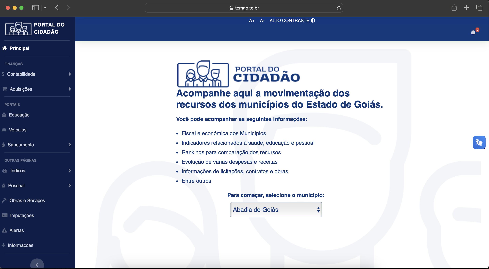
Available at https://www.tcmgo.tc.br/pentaho/api/repos/cidadao/app/index.html since 2019. The data collected is the result of scraping the State Court website with information for citizens.

All data is offered in a single table with no verification or payment date. A limitation of the data is that there is no bidding information that can connect with bid data to be added in the future.

## MG - Minas Gerais
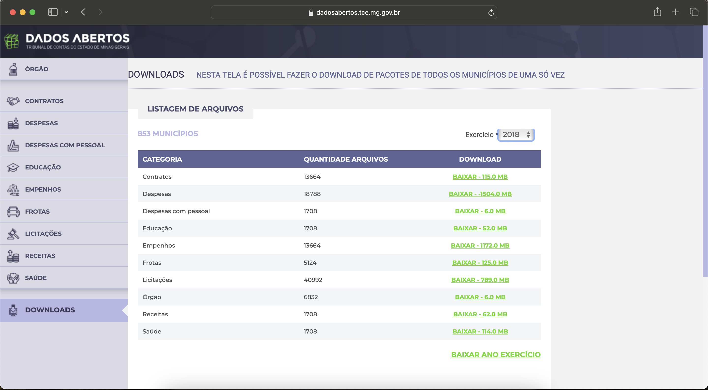
Available at https://dadosabertos.tce.mg.gov.br/ since 2014. The State Court offers download data by municipality or all files by year and theme. The files are disagregated but the conecction is made by an id created by own State Court. Some municipalities seems to have incomplete data for recent years with discrepancies in values and total of observations.

In the file *licitacao.licitacao* we have all competitive bids and the file *licitacao.dispensa* all observations of exemption or ineligibility. In the files *licitacao.recLicitacao* and *licitacao.recDispensa* we obtained the bid estimated value. If we aggregate by bid the total value we obtain the homologated value through the files *licitacao.homologLicitacao* and *licitacao.fornDispensa*.  To compose **bid-item** table we use *licitacao.itemLicitacao*, *licitacao.cotacaoLicitacao*, *licitacao.refLicitacao*, *licitacao.homologLicitacao*, *licitacao.itemDispensa*, *licitacao.cotDispensa*, and *licitacao.fornDispensa*. We merge these files to obtain your respective quotations or reference prices. We also include the winners, quantities and the values. For the **bid-participant** we have all qualified participants by bidding in *licitacao.habLicitacao*. We can find out which of these are winners by merging with the item bidding table. We detected inconsistencies between ‘total_value’ and ‘budget_value with more details [here](https://docs.google.com/document/d/1jcNyUQOOXfAKCQmjQD4eIUIx5gqVdqf3Re7o8KioaK0/edit?usp=sharing). The original data has 1.2M observations, but using document and company name there are only 330,747 unique participants. Some participants appear more than 3,000 times on the base. Examples: BIOHOSP PRODUTOS HOSPITALARES LTDA, ALFALAGOS LTDA. Some observations we construct an identification about participant type (CPF or CNPJ) due to a discrepancy in the total number of digits. 

For the budget execution part we join the *despesa* files trough the variable *seq_empenho*. The files with *rsp* in the name shows verifications and payments from another periods that are verified or paid the sequence. Every observation has a sequence that makes that observation unique. For the sake of caution, we still created the id_bd variable

## MS - Mato Grosso do Sul
In contact with [TCE-MS](https://www.tce.ms.gov.br/ouvidoria/manifestacoes/nova/3) through Access Information Law under protocol 2207437, it did not provide information that could satisfy the request about municipalities budget execution.

## PB - Paraíba
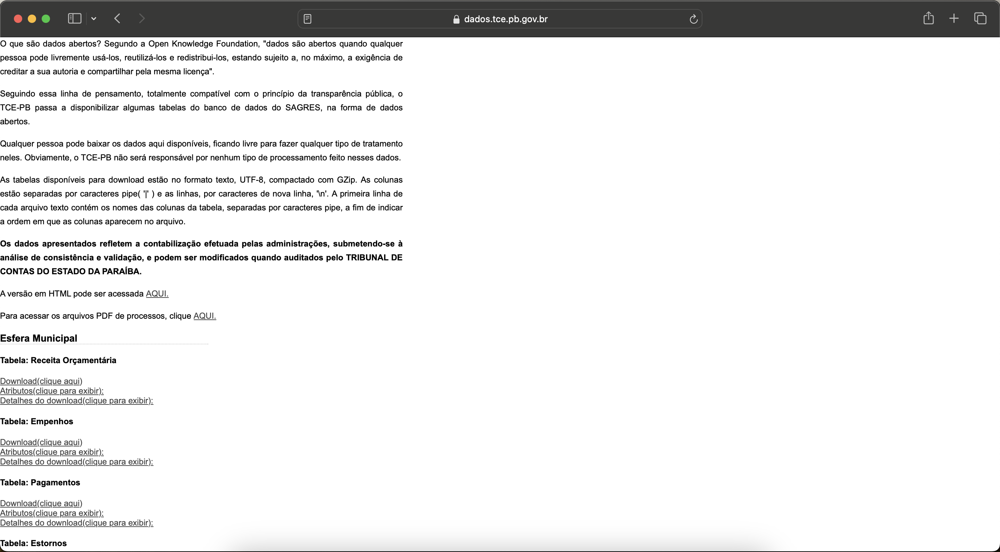
Available at https://dados.tce.pb.gov.br since 2008, the TCE-PB offers data in an unique file in .txt format. 

To build the **bid** table at the bidding level exclusively, we exclude variables related to participants and also duplicate rows in the set municipality, entity and year, keeping only information about bids. The same file provided for the bid table (*Licitacoes_Propostas*), contains the information to generate the **bid-participant** table as participants and proposals information. However, there is no data to feed the **bid-item** table.

From the files *TCE-PB-SAGRES-Empenhos_Esfera_Municipal* and *TCE-PB-SAGRES-Estornos_Esfera_Municipal* they form the **commitment** table. The reversal is only recorded in this table, since the moment of the reversal cannot be identified and in the other tables there is no guaranteed uniqueness of the observation.The files of **verification** and **payment** generate from *TCE-PB-SAGRES-Liquidacoes_Esfera_Municipal* and *TCE-PB-SAGRES-Pagamentos_Esfera_Municipal*, respectively. In the payment table there is no information regarding the verification number, therefore the variable `id_liquidacao_bd` cannot be recreated in payment table, therefore it is not created in verification table.

## PE - Pernambuco

Available at https://sistemas.tce.pe.gov.br/DadosAbertos/Exemplo!listar since 2013. The State Court offers an API to get the data. 

Initially, a disparity in the identifier did not allow the creation of an `id_empenho_bd` nor a cross-section analysis of the data, especially because the *Empenho-Resumo* file showed all the movement about reinforcements and cancellations, however, it was impossible to connect all phases. We assume now with the updated data, that only *VALOREMPENHO* variable as commitment final value. As in all states, we create the `id_empenho_bd` obeying the variables available in all tables.

## PI - Piauí
In contact with [TCE-PI](https://www.tcepi.tc.br/) through Access Information Law under protocol 0325/2024, it did not provide information that could satisfy the request about municipalities budget execution.

## PR - Paraná
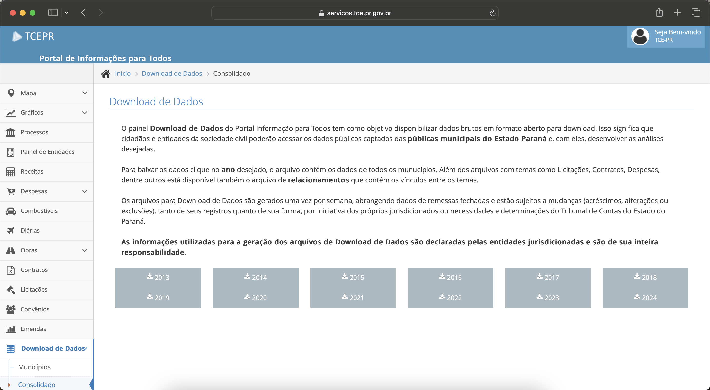
Available at https://servicos.tce.pr.gov.br/TCEPR/Tribunal/Relacon/Dados/DadosConsulta/Consolidado since 2013, the TCE-PR offers data in .xml format that is converted and harmonized and offered in BigQuery. 

The original data offers a unique `id` connecting all data between tables without the necessity of more treatment in data, just the adjustments due to the main table format.

## RJ - Rio de Janeiro
Rio de Janeiro offers a particularity, as do a few other states: the capital has the municipal Court of Auditors, while the other municipalities are supervised by the State Court of Auditors.

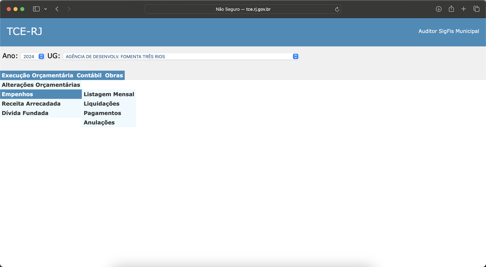
Available at http://tce.rj.gov.br/auditormunicipio/Default.aspx since 2002, a script was needed to collect data using scraping techniques for download from all 91 municipalities. The data is decentralized for each phase of budget execution: commitment (also cancellation), verification and payment, as well as for the management units, i.e., for each municipality the data is made available through public administration entities.

A limitation of the data concerns the creditor's documentation. In general terms, the *CPF* or *CNPJ* is not provided in the data and despite the company name being present, the search for the identifier could lead to errors.

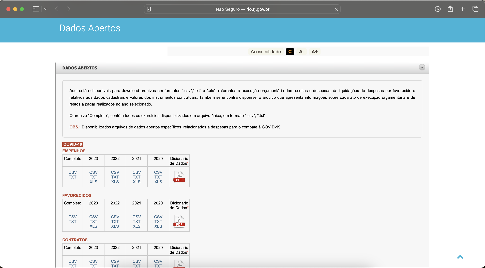
Budget execution data for the capital of Rio de Janeiro is available at http://www.rio.rj.gov.br/web/contasrio/dados-abertos#titleo on the site *Contas Rio* operated by the General Comptroller of the municipality.

The data is available since 2008, however exists two versions of data. Before 2017 the data is offered just in wide format with only commitment date in *open_Data_Empenho_* file. From 2017, the budget execution is in long format with act description as commtiment, cancellation, verification or payment with respectives dates. In a way, the file *open_Data_Desp_por_Ato_* is more complete. The Genetral Comptroller offers the data from 2014, but the files of 2014, 2015 and 2016 are corrupted.

## RN - Rio Grande do Norte

Available at https://apidadosabertos.tce.rn.gov.br/swagger/ui/index#/ since 2016, the State Court offers an API to obtain the data with certain limitations on the variables. The API provides separate tables for commitment, verification, and payment. We have scraped all available commitments, <u>however the verification and payments are in progress to obtain all observations due to the format with all parameters in the verification or payment part</u>.

The data is considered limited because it does not provide information mainly about the function of the commitment, nor the nature of the expense (*elemento_despesa*), since this variable is responsible in our research for determining public purchases.

The API also provides state and municipal data showing data from management units administered by the State; however, we limited ourselves to municipal administration entities. To this end, a table was created based on the original file of institutions, assigning the name of the municipality and its governance.

## RO - Rondônia
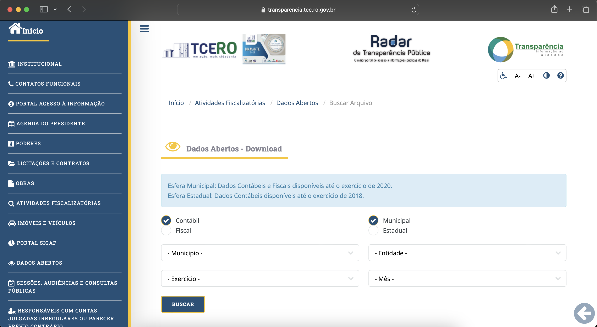

We developed a script for the Rondônia data that captures municipal-level data for all municipalities, all entities, all years, and months at the **accounting** level available at https://transparencia.tce.ro.gov.br/transparenciatce/Remessa/Pesquisar. The original folder is presented as *Sigap_yearmonth_entity_id* with all files with fiscal informations, included commitment, verification and payment data in .xml type. The site is limited to data from 2019 and 2020. An auxiliary file is created to ensure the connection and identification between units and their respective municipalities.

Due to the limited availability of data (only 2 years), the data appears to be incomplete in relation to the total observations. This is because, in validation with Siconfi, our results are underestimated compared to the totals presented by the 52 municipalities of the State.

## RS - Rio Grande do Sul
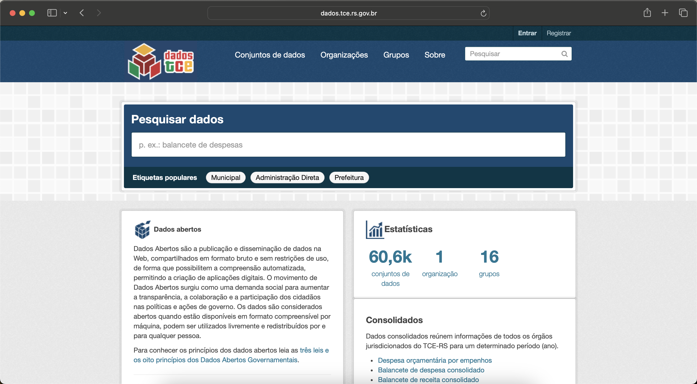
Available at https://dados.tce.rs.gov.br from 2004. The State Court offers a CKAN system to get the data. 

Despite the availability of data since 2004, with a few observations dated from 1995 onwards, the quality of the original data is only guaranteed from 2010. Data validation is guaranteed by comparing the aggregated values ​​at the year-municipality level with the Public Accounts Fiscal System (*Siconfi*).

The original file brings all commitments from 497 municipalities in a year. This data is in long format, i.e., the same commitment show repeated many times in file. The variable *tipo_operacao* classify commitment (*E*), verification (*L*) and payment (*P*). To garantee the unique identification of observation we create many dummies to register duplicated and set `id_empenho_bd`as null in case if this condition is true.

## SC - Santa Catarina
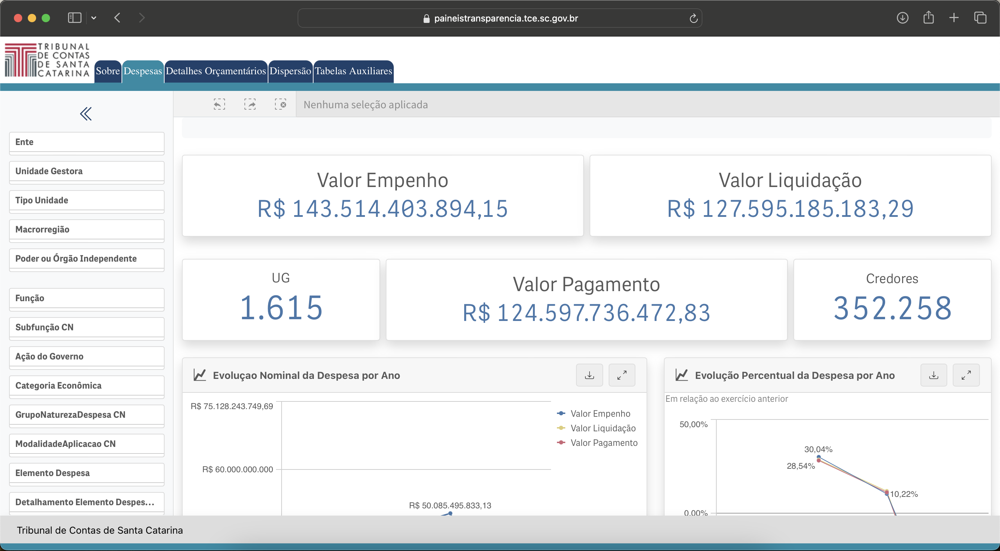
The data collected is from the dashboard developed by *TCE-SC* available at https://paineistransparencia.tce.sc.gov.br/extensions/appDespesasMunicipaisExternoNovo/index.html since 2021. From the data available in the *Detalhes Orçamentários* menu, we obtained aggregated results for commitment, verification, and payment. There is only the commitment date, making a cross-section analysis of budget execution impossible.
A disclaimer is that the data shows some instability. During the scraping exercise, the number of observations in the tables varied between collections and their respective updates. 

The bidding data was captured in the same way available at https://paineistransparencia.tce.sc.gov.br/extensions/AppLicitacoesExterno/index.html. In the case of SC, the data only includes the names of the management units. Additionally, there are significant variations in spelling, such as *Fundacao Municipal de Esporte* and *Fundacao Municipal de Desporto*. We then clean this variable by removing the names of the municipalities, such as in the case of *Fundo Municipal de Saude de Blumenau*, and also correcting for possible spelling differences as in the previous example. The cleaned variable is only used as an auxiliary to generate an ID for each management unit. Thus, all Municipal Health Funds receive the same code, and all Municipal Sports Funds receive the same code. We use this auxiliary ID in the construction of the `id_licitacao_bd`. In this table, each observation is a bid - a notice number, in a specific municipality and management unit. In the *despesa_itens_participante* file reports participants at the item level. We excluded information about items and left only information about the participants.

## SP - São Paulo
Just like Rio de Janeiro, the municipality of São Paulo, capital of the State, has a single Comptroller's Office while the other 644 municipalities have a State Audit Court that legislates over them.

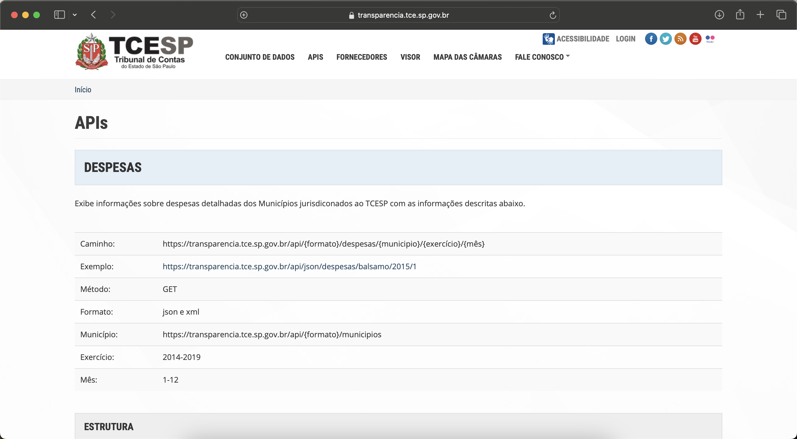
Available at https://transparencia.tce.sp.gov.br/apis since 2008. The data is in year-municipality level with the variable *tp_despesa* classifying commitment, verification and payment, i.e., long format. As in Rio Grande do Sul, we create many dummies to create a unique `id_empenho_bd` setting null when in case of duplicated. 

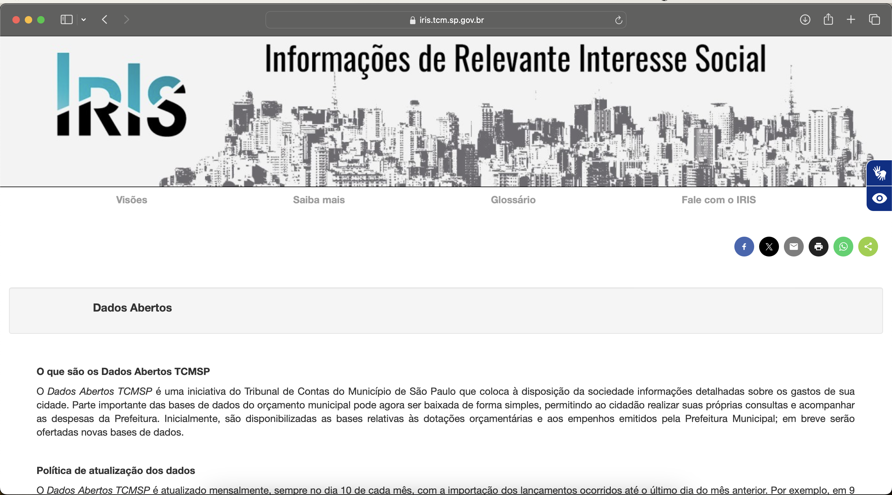
Available at https://iris.tcm.sp.gov.br/Iris/148870 since 2005. The data for the municipality of São Paulo is in wide format, as we only have the commitment date identified with all values aggregated at the commitment level.

## TO - Tocantins

We created a scraping code to capture data from the commitments, verifications, payments, and bidding tables from the *TCE-TO* website, available at https://portaldocidadao.tce.to.gov.br/estadomunicipios/index since 2013, with .xls files at the year-municipality level. The data refers to the *remessa Consolidada*, obtaining the files from the *Dados Abertos* option.
