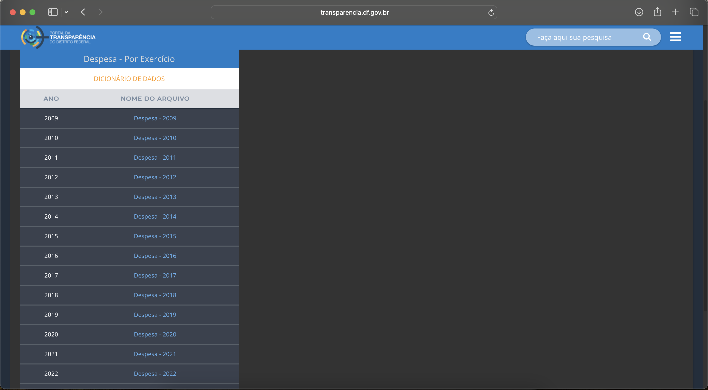
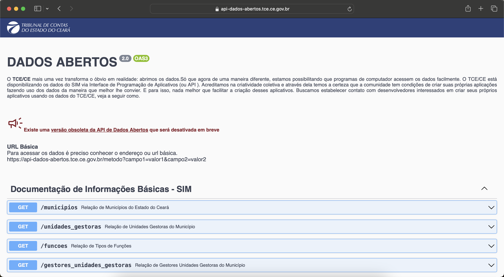

# Original Sources

This documentation contains information about the main files and sources used in the construction of public procurement and budget execution tables. Additionally, we list open questions and limitations encountered throughout the project by state.

## DF - Distrito Federal

Available in https://www.transparencia.df.gov.br/#/downloads#des from 2009. The State Court offers the data for download in the click-point model. In addition, offering a visualization panel with the main results of expenses and revenues in the municipality of Brasília. 

We don't have **bid** data yet. The **commitment** table is the result of files: *Despesa_Empenho*, *Despesa_Empenho_Descricao*, and *Despesa_Empenho_Subelement* which together classify completely the observation. As the files *Despesa_Nota_Lancamento_Evento* and *Despesa_Nota_Lancamento_x_Nota_Empenho* show the required information about **verification**. This last file contains the identification between commitment and verification observations. The payment table is based on *Despesa_Pagamento*. Some observations are broken because of the original data format. 

## CE - Ceará

Available in https://api.tce.ce.gov.br/ from 2009. The State Court offers an API to get the data. 

The **bid** from files (*licitacoes*) bring together general information about competitive bids and exemptions/non-enforceability. For the **bid-iten** table we merge *itens_licitacoes* and *licitantes* files. The first contains information about the bid items and the second about the winners. For the **bid-participant** we remove duplicates at the id, municipality and year level, e.g., participants who win more than one item in the same bid. The construction of `id_licitacao_bd` not generate unique id (around 0.87% are duplicated) analyzing the relevant variables as municipality, entity, year. For example, we have a bid with same number, description and values (described better [here](https://municipios-transparencia.tce.ce.gov.br/index.php/municipios/licitacoes/mun/031/versao/2019)), but directioned to different entities:  
FMS04.03.002/19  
PMB04.03.002/19  
FMA04.03.002/19  
FME04.03.002/19
These cases give reasons to believe that we have the same bid, altought we exclude here the observations duplicated. 

In **commitment** table we use *notas_empenhos* and *anulacoes_empenho*, while **verification** is based in *liquidacoes* and *estornos_liquidacoes*, as **payment** table is from *notas_pagamentos* and *estornos_pagamentos*. All this observations is identified by a commitment number not unique. We create *id_empenho_bd* concatenating some variables as municipality, year and entity ensuring the uniqueness of observations. 

## MG - Minas Gerais

Available in https://dadosabertos.tce.mg.gov.br/ from 2014. The State Court offers download data by municipality or all files by year and theme. The files are disagregated but the conecction is made by an id created by own State Court. Some municipalities seems to have incomplete data for recent years with discrepancies in values and total of observations.

In the file *licitacao.licitacao* we have all competitive bids and the file *licitacao.dispensa* all observations of exemption or ineligibility. In the files *licitacao.recLicitacao* and *licitacao.recDispensa* we obtained the bid estimated value. If we aggregate by bid the total value we obtain the homologated value through the files *licitacao.homologLicitacao* and *licitacao.fornDispensa*.  To compose **bid-item** table we use *licitacao.itemLicitacao*, *licitacao.cotacaoLicitacao*, *licitacao.refLicitacao*, *licitacao.homologLicitacao*, *licitacao.itemDispensa*, *licitacao.cotDispensa*, and *licitacao.fornDispensa*. We merge these files to obtain your respective quotations or reference prices. We also include the winners, quantities and the values. For the **bid-participant** we have all qualified participants by bidding in *licitacao.habLicitacao*. We can find out which of these are winners by merging with the item bidding table. We detected inconsistencies between ‘total_value’ and ‘budget_value with more details [here](https://docs.google.com/document/d/1jcNyUQOOXfAKCQmjQD4eIUIx5gqVdqf3Re7o8KioaK0/edit?usp=sharing). The original data has 1.2M observations, but using document and company name there are only 330,747 unique participants. Some participants appear more than 3,000 times on the base. Examples: BIOHOSP PRODUTOS HOSPITALARES LTDA, ALFALAGOS LTDA. Some observations we construct an identification about participant type (CPF or CNPJ) due to a discrepancy in the total number of digits. 

For the budget execution part we join the *despesa* files trough the variable *seq_empenho*. The files with *rsp* in the name shows verifications and payments from another periods that are verified or paid the sequence. Every observation has a sequence that makes that observation unique. For the sake of caution, we still created the id_bd variable

## MS - Mato Grosso do Sul
In contact with [TCE-MS](https://www.tce.ms.gov.br/ouvidoria/manifestacoes/nova/3) through Access Information Law under protocol 2207437, it did not provide information that could satisfy the request about municipalities budget execution.

## PB - Paraíba

Available in https://dados.tce.pb.gov.br from 2008, the TCE-PB offers data in an unique file in .txt format. 

To build the **bid** table at the bidding level exclusively, we exclude variables related to participants and also duplicate rows in the set municipality, entity and year, keeping only information about bids. The same file provided for the bid table (*Licitacoes_Propostas*), contains the information to generate the **bid-participant** table as participants and proposals information. However, there is no data to feed the **bid-item** table.

From the files *TCE-PB-SAGRES-Empenhos_Esfera_Municipal* and *TCE-PB-SAGRES-Estornos_Esfera_Municipal* they form the **commitment** table. The reversal is only recorded in this table, since the moment of the reversal cannot be identified and in the other tables there is no guaranteed uniqueness of the observation.The files of **verification** and **payment** generate from *TCE-PB-SAGRES-Liquidacoes_Esfera_Municipal* and *TCE-PB-SAGRES-Pagamentos_Esfera_Municipal*, respectively. In the payment table there is no information regarding the verification number, therefore the variable `id_liquidacao_bd` cannot be recreated in payment table, therefore it is not created in verification table.

## PE - Pernambuco

Available in https://sistemas.tce.pe.gov.br/DadosAbertos/Exemplo!listar from 2013. The State Court offers an API to get the data. 

## PI - Piauí
In contact with [TCE-PI](https://www.tcepi.tc.br/) through Access Information Law under protocol 0325/2024, it did not provide information that could satisfy the request about municipalities budget execution.

## PR - Paraná

Available in https://servicos.tce.pr.gov.br/TCEPR/Tribunal/Relacon/Dados/DadosConsulta/Consolidado from 2013, the TCE-PR offers data in .xml format. 

## RJ - Rio de Janeiro

## RS - Rio Grande do Sul

## SC - Santa Catarina

Licitação

Execução Orçamentária

## SP - São Paulo

## TO - Tocantins
In contact with [TCE-TO](https://tceto.omd.com.br/ouvidoria/externo/consulta.do) through Access Information Law under protocol 249.184.261.992, it did not provide information that could satisfy the request about municipalities budget execution.