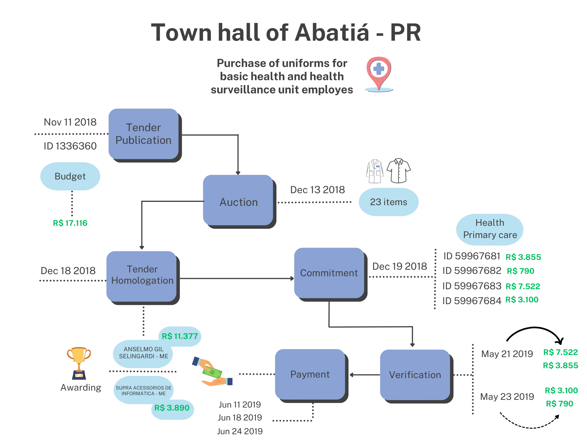

# Procurement

Public procurement is the process through which governments acquire goods and services. As a rule, governments are expected to run competitive tenders when buying goods and services. The specific method used, such as reverse auctions, invitations to tender or framework agreements, will depend on the nature of the object to be acquired and its estimated value. In exceptional circumstances (such as when there is only one feasible supplier or during an emergency) or when purchase values are small, officials can waive tenders and directly contract with suppliers (see \autoref{fig:desc_procur_methods} for more details). 

Our municipal public procurement dataset is organized into three tables: _tender_, _tender-item_, and _tender-participant_.

In the _tender_ table, one observation is a tendering procedure that some agency in a given municipality executes. Tenders are often comprised of several _items_, so they should be thought of as a batch of items that are separately sold - one tender might contain, for example, ten different items that are purchased from four different suppliers. Each tender often includes a general description of the items being purchased (like "purchase of cleaning goods for city hall" or "hiring of mechanical services"), classifiers for groups of goods/services, the modality used for the purchase, and the status of the tender (if it was completed, canceled or deserted, for example). It will also sometimes include the total estimated or budgeted value for that batch of goods. Each tender process is uniquely identified by the variable $id\_licitacao\_bd$.

In the _tender-item_ table, each observation is an item, linked to a specific tender. Items will often include a textual description of the specific purchase (e.g., "cleaning detergent 0.5L" or "accounting services"), quantities, unit prices and total prices. In some cases, the item will separately describe the "quoted" prices, before the execution of the tender, and the price for the winning proposal. The item dataset also includes the name and document number of the winning entity, which can be a firm or individual. Each item is uniquely identified by the variable $id\_item\_bd$ and can be connected to tenders by the variable $id\_licitacao\_bd$.

Finally, in the _tender-participant_ table each observation is a participant in a given tender. Some municipalities will only provide winners in each tender, so in that case these will be the same as those listed in the tender-item table. Others will include all participants in a tender, including those that did not win any contracts. The data includes names and document numbers of each participant, as well as an indicator of whether they are winners. Each participant is uniquely identified by the pair of variables $documento$ and $razao\_social$, and can be connected to tenders by the variable $id\_licitacao\_bd$.

For procurement, across the six states covered, we observe over 2.4 million unique tenders and almost 800,000 unique suppliers. Since we observe microdata on each tender and often items, we are able to compute statistics such as the share of tenders that are deserted and/or unsuccessful (e.g., no bidders in a competitive tender) and the average number of items listed in a tender. We can also document, for example, that across states approximately 30%-40% of tenders are not competitive auctions - meaning they are directly awarded to suppliers by means other than an auction - but in terms of total purchase value these non-competitive tenders always represent less than 20% of total amounts. This is consistent with the fact that, similar to other countries, Brazilian law allows small purchases to be performed without competitive auctions \citep{fazio_rethinking_2022}. We can also compute measures of competitiveness in tenders, such as the number of participants per tender - the average fluctuates between two and four across the municipalities in our sample. The dataset often contains unique identifiers for each supplier, which in Brazil vary if the supplier is an individual or a firm, allowing us to compute the share of suppliers identified as firms (which vary substantially across states, from less than 60% in CE and PB to over 80% in MG). 

We provide an illustrative example of the nature of our data in Figure 1, highlighting a case in which we can track the entire process of public procurement and budget execution[^1].

In this figure we zoom in on one case involving the town hall of Abatiá - a municipality with less than 10,000 inhabitants but relatively high income in the state or Paraná - which initiated a tender to procure uniforms for basic health employees, identified by ID 1336360. The tender was officially published in November 2018, with an initial budget of 17,116 BRL. The auction took place on December 13 of the same year, during which bids were received for 23 items, comprising different types of t-shirts and bags. The tender resulted in two winners, one for supplying t-shirts and another for supplying bags. Subsequently, the tender was officially homologated on December 18.

One day after the tender's homologation, four separate commitments were made - meaning that the local government set apart funds to pay for the purchases, once goods were delivered. Verification of delivery happened in mid-May 2019, five months after the end of the tender. Less than 30 days later, three separate payments were made to different agents that won the contracts, with total values of 11,377 BRL and 3,890 BRL. For the purchase of this relatively simple good, a total of 235 days elapsed between the tender publication and the last payment.

The example above shows the potential of this newly constructed dataset in providing researchers, policy makers, and the civil society with a granular view of how local governments in Brazil acquire goods and services and execute their budgets. It also illustrates the potential for similar datasets to be developed in other countries where scattered data might exist but require upfront investment to be collected, cleaned, and harmonized.

|                                        | CE      | MG      | PB      | PE      | PR      | RS      | Total     |
|----------------------------------------|---------|---------|---------|---------|---------|---------|-----------|
| Number of distinct tenders             | 271,345 | 643,442 | 133,201 | 220,025 | 735,632 | 417,348 | 2,420,993 |
| Deserted tenders (\%)                  | -       | -       | -       | 3.1     | 2.6     | 0.5     | 1.2       |
| Unsuccessful tenders (\%)              | -       | -       | 0.0     | 6.3     | 3.0     | 0.6     | 1.6       |
| Non-competitive tenders (\%)           | 27.6    | 31.8    | 38.3    | 38.0    | 45.0    | 45.5    | 38.6      |
| Non-competitive tenders value (\%)     | 10.0    | 18.0    | 12.0    | 15.0    | 19.0    | 12.0    | 14.9      |
| Has item information (\%)              | 93.3    | 100     | -       | -       | 92.0    | 100     | 82.2      |
| Avg. number of items per tender        | 25.1    | 25.4    | -       | -       | 32.2    | 12.4    | 23.8      |
| Has participant information (\%)       | 94.4    | 96.5    | 100     | 100     | 92.7    | 92.2    | 94.9      |
| Number of distinct participants        | 189,738 | 330,745 | 50,236  | 94,864  | 175,024 | 119,322 | 959,929   |
| Number of distinct suppliers           | 137,997 | 301,447 | 43,548  | 66,466  | 154,301 | 91,609  | 795,368   |
| Firms among suppliers (\%)             | 55.4    | 83.2    | 47.8    | 66.4    | 71.6    | 79.0    | 72.3      |
| Avg. number of participants per tender | 2.8     | 2.3     | 2.6     | 3.9     | 3.2     | 3.6     | 3.1       |
| Avg. number of suppliers per tender    | 1.5     | 2.1     | 2.0     | 1.4     | 2.2     | 2.2     | 1.9       |
| Number of distinct municipalities      | 184     | 853     | 223     | 184     | 392     | 497     | 2333      |

This table presents the descriptive statistics from the public procurement dataset. Deserted tenders refers to a situation where no proposals were submitted by potential bidders in response to a tender notice, while unsuccessful tenders occur when proposals were submitted but didentifier not meet the requirements or the tender process was cancelled or revoked. The variables "Has item information" and "Has participant information" refer to the percentage of tender identifiers with any information related to items or participants, respectively. The definition of non-competitive tender encompasses both _dispensa_ and _inexigibilidade_. To calculate the percentage of "Non-competitive tenders value" we use the variable $valor\_corrigido$ winsorized at percentiles 0.01 and 99.9. Additionally, the percentage of firms among suppliers is calculated as the number of distinct firms divided by the number of distinct suppliers, where firms are those whose identifier has 14 digits.

<Footnotes>
[^1]: We note that this connection between public procurement and budget execution is currently only possible for the state of Parana (PR), which provides a table connecting tender IDs to commitment IDs. Approximately 78% of the procurement IDs and 38% of total commitment IDs can be found within this correspondence table.